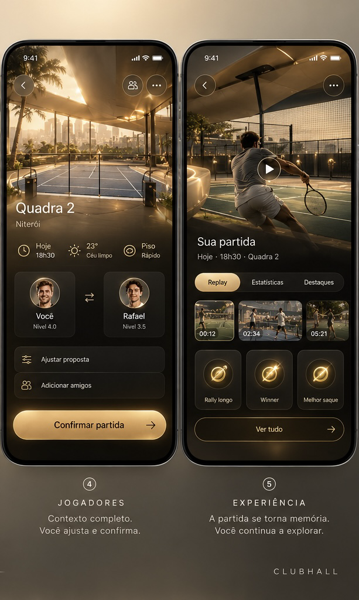
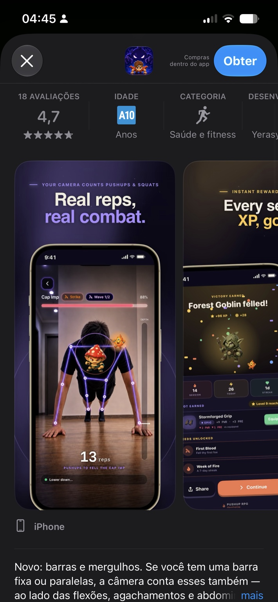
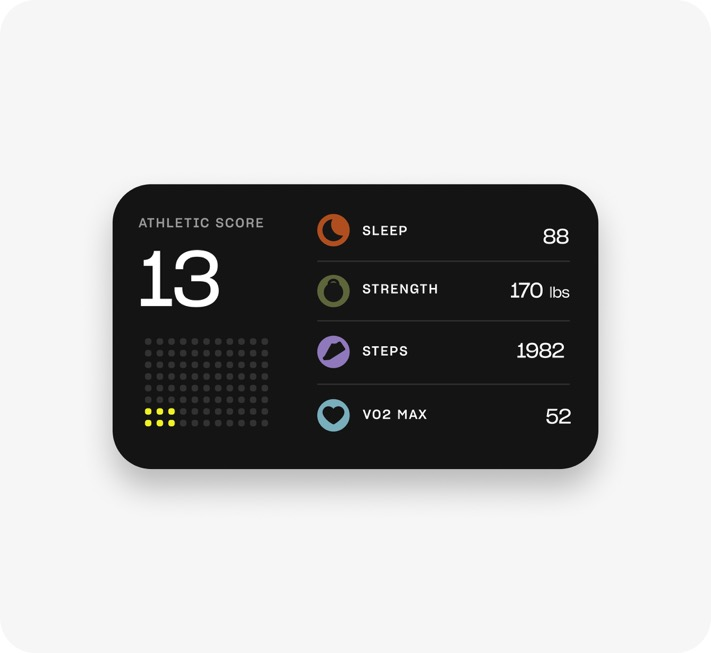

# Referências visuais do usuário

Arquivos originais anexados à conversa de 19/09/2026, preservados sem edição. São referências de direção de produto/UI, não provas de funcionalidades implementadas nem assets liberados para redistribuição comercial de marcas de terceiros.

## ClubHall: partida e memória

Preservar: vídeo/cena como protagonista, ouro em ações selecionadas, materiais suaves, momentos em timeline e conquistas da partida. A nova experiência deve aumentar interatividade e continuidade, sem copiar uma imagem estática como produto completo.

## Ação física → gameplay

Preservar o princípio: acontecimento físico produz feedback perceptível e recompensa. Não copiar personagens, elementos de combate ou identidade do app de referência. A pose precisa vir de detecção real e o evento da evidência apropriada.

## Estatísticas compactas

Preservar: legibilidade e hierarquia compacta. Para tênis, substituir por métricas esportivas definidas e seus denominadores; não inventar athletic score, sono ou VO2 a partir de vídeo.

Outras referências da conversa: superfícies iOS suaves, cards de progresso, troféus/objetos com profundidade, mini-apps e interface viva. O plano exige um componente principal por contexto e divulgação progressiva, com pouco ruído visual.
