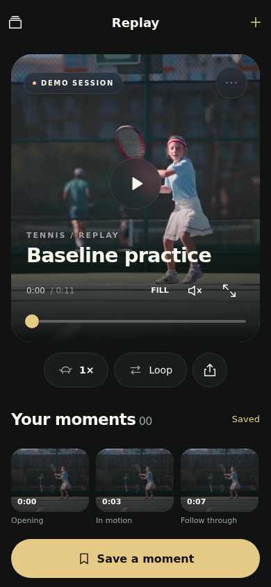
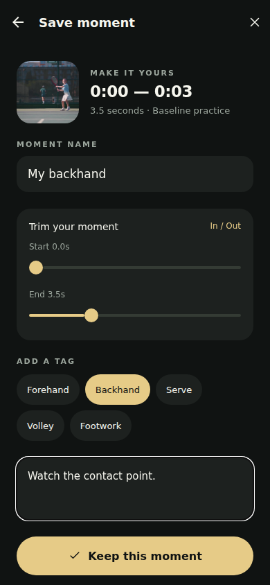

# Replay for iPhone

Branch: `codex/replay-ios`. This user-authorized Expo prototype is based directly on the existing Replay repository main branch. The earlier desktop-editor experiment remains preserved in its separate local branch. No changes to the authenticated ClubHall pilot or its Stage configuration are included.

## Experience

- An immersive video surface with discreet playback controls, a compact floating control dock, and a horizontal moment strip.
- System typography and SF Symbols on iOS. Native Stack navigation, swipe-dismissable modal/form sheets, selection haptics, and spring press feedback.
- Real `expo-glass-effect` surfaces on compatible iOS devices, guarded by both API and runtime availability; dark blur fallback elsewhere.
- A 670 KB bundled tennis demo makes the first session playable without a third-party video request. Demo content is explicitly labelled.
- Import from the system video picker. Play, pause, scrub, change between 1×, 0.5× and 0.25×, mute, fit/fill, fullscreen, and loop.
- Save a manually chosen time range with a name, shot tag and private note. Saved playback stops at the out point; looping repeats the selected range. Chapters divide the recording by time and do not claim shot recognition.
- Rename sessions, navigate the collection, edit moments, and remove/undo a moment. Imported originals in the photo library are never deleted.
- Share the original recording, export moment notes, or export a HyperFrames HTML composition with Original / Club Gold lower-third styling.

## Storage and architecture

`apps/replay-mobile/app` contains Expo Router screens. Reusable native components and storage live in `src`; native and browser implementations are separated with `.web.ts` files.

Native imports are copied into the application document directory with `expo-file-system`. Copy completion is awaited before the session is added. Metadata is stored with AsyncStorage; writes are serialized to prevent a slower prior write from replacing a newer edit. The browser implementation stores video blobs in IndexedDB and recreates object URLs after reload. No recording is uploaded.

Video thumbnails are generated from the source with `expo-video` on native platforms and a temporary video/canvas on web. Thumbnail failures leave a usable placeholder without blocking playback. Preview images are not AI analysis.

This prototype has its own explicitly versioned native session document. It does not silently claim compatibility with the older analysis lab backup format. Backend analysis adapters and the original web lab remain available in the repository.

## HyperFrames

The useful integration is export composition authoring, rather than embedding a browser timeline into the native player. The portable HTML records sequential start times, durations and `data-media-start` source trims. Place the original recording beside it as `source.mp4`, then render with HyperFrames. The final MP4 is not rendered inside this Expo prototype.

Official references:

- [HyperFrames HTML schema](https://hyperframes.heygen.com/reference/html-schema)
- [Producer rendering](https://hyperframes.heygen.com/packages/producer)
- [Accent underline lower-third](https://hyperframes.heygen.com/catalog/blocks/lt-accent-underline)
- [Source and Apache-2.0 license](https://github.com/heygen-com/hyperframes)

## Validation

- TypeScript: passes.
- Expo production bundles: iOS, Android and web pass.
- Native app source ESLint: no errors; three Fast Refresh organization warnings for files that export hooks/helpers alongside components.
- Browser workflow at 390 × 844: real demo playback, rate change, pause on opening the editor, save/tag/note, reload persistence, removal/undo, local video import and reload playback, session rename, composition download, and collection navigation pass with no browser JavaScript errors.
- The committed Playwright suite covers persistence, bounded playback, deletion recovery, import, rename, collection switching and exports.
- Screenshots are from the actual Expo web renderer. They are not screenshots from an iPhone.

Native module bundling is not a device test. Physical iPhone playback, Photos permission behavior, native share UI, Liquid Glass, haptics, sheet detents, large recordings, background interruptions and accessibility settings still require device verification. No TestFlight build or EAS update is published by this branch.

## Visual decisions

The interface prioritizes the recording and the next action. Gold marks selection and the save action, with restrained green-black surfaces. The hero can fill the frame for the demonstration; imported videos start in Fit mode so their full frame remains visible. Fullscreen and Fit/Fill are explicit controls. Editing, collection and sharing appear only when requested.

The first deliverable is the running Expo app and a browser preview of that same app. Native glass and gestures use platform primitives, not CSS imitations.

## Assets

`assets/tennis-demo.mp4` is a resized, silent excerpt of [Pexels video 8224602](https://www.pexels.com/video/8224602/). `tennis-poster.jpg` is a frame from that recording. [Pexels license](https://www.pexels.com/license/). These are demonstration assets, not the user's recording. All other visuals are native layout, system symbols, or simple SVG fallback icons.

### Rendered previews

